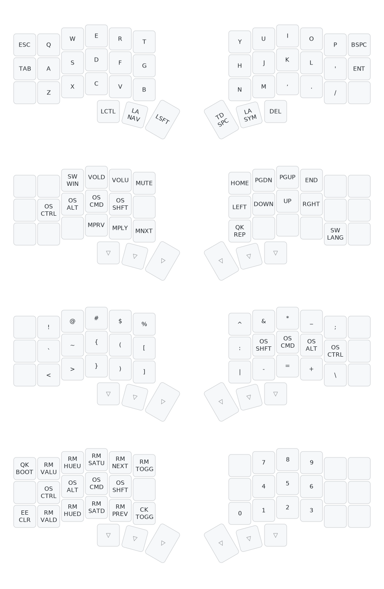

This is a 42 keymap layout with home row mods no mod-tap
```
qmk c2json -kb boardsource/unicorne -km VictorRO --no-cpp | keymap parse -c 12 -q - >keyboards/boardsource/unicorne/keymaps/VictorRO/sweep_keymap.yaml
keymap draw keyboards/boardsource/unicorne/keymaps/VictorRO/sweep_keymap.yaml > keyboards/boardsource/unicorne/keymaps/VictorRO/viz/sweep_keymap.unicorn.svg
```



